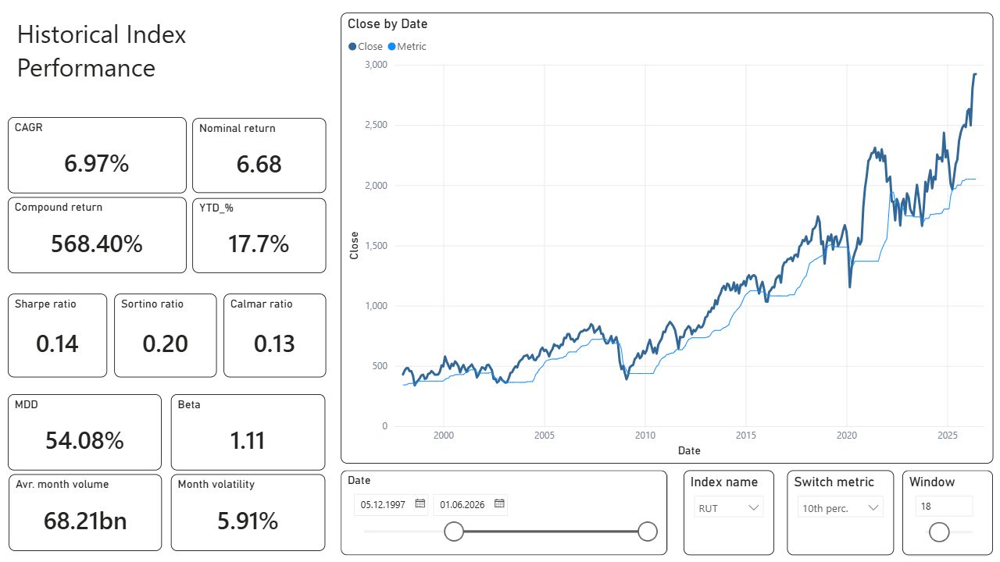
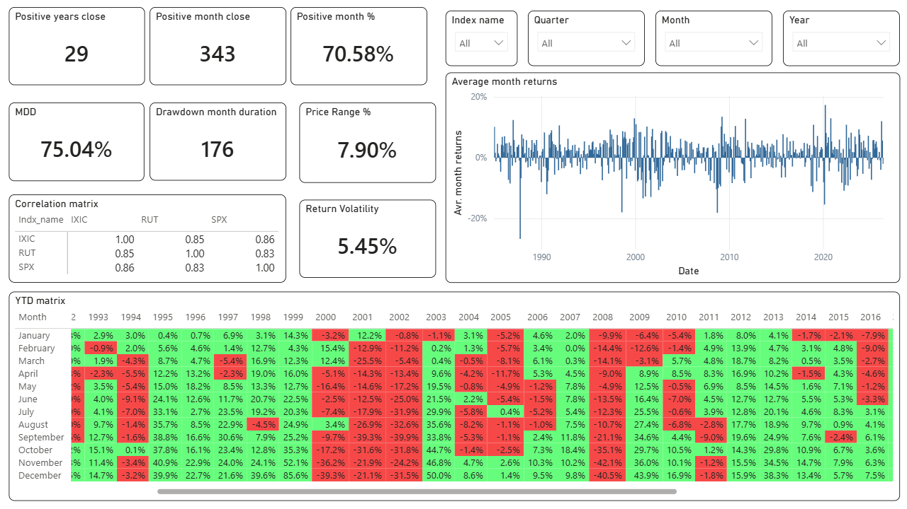
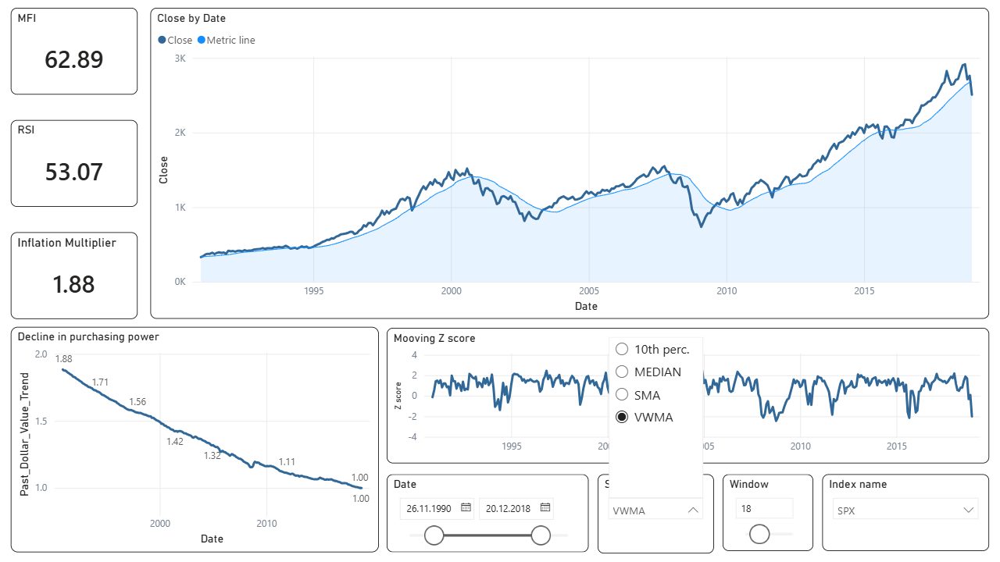

# Historical-Index-Performance
Amateur analysis of specific indicators for evaluating three stock indices

# Market Benchmark Dashboard

The core idea and motivation behind this dashboard were to hone my data-gathering skills, deepen my understanding of the DAX engine, and simply out of pure interest.

## General: Asset Comparison

Below is a screenshot of the first page, which highlights the most representative metrics for asset comparison:

> **Note:** The *Nominal return* here answers the question: "How much money would you have at the end of the investment period if you had initially invested exactly $1?"

---

## Stat: The Emotional Price of Profit

The second page provides insight into the emotional price investors pay for their profits. 

The return matrix, combined with the average monthly return distribution and slicers, allows you to analyze which months, quarters, and years were the most bullish, and conversely, which were the most bearish.

---

## Quant: Quantitative Analysis

The third page is entirely dedicated to quantitative analysis. 

Technical indicators such as RSI, Z-score, and others help visualize periods when the market was overbought or oversold. Meanwhile, the dynamic selection of moving and rolling windows provides a much clearer picture of the market's trajectory across specific timeframes.

---

### Conclusion

The set goals were achieved, and new concepts were learned. 

On to the next project!
